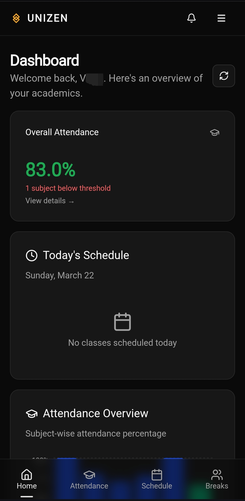
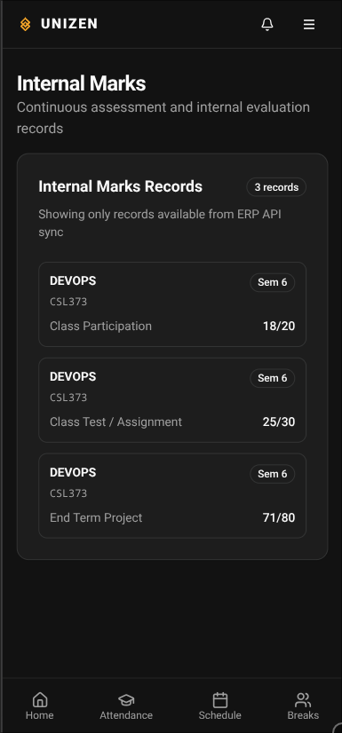
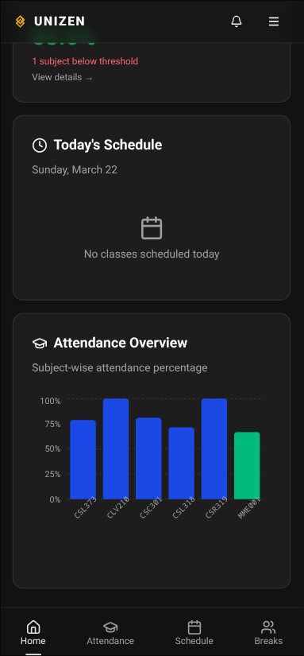
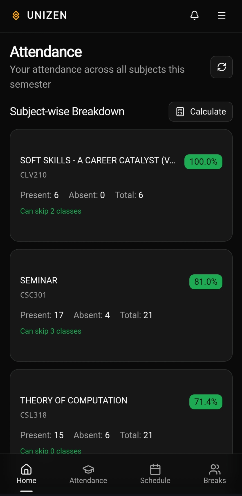
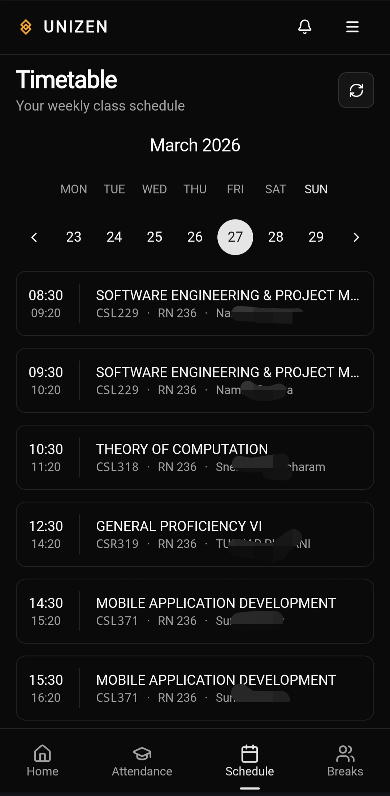
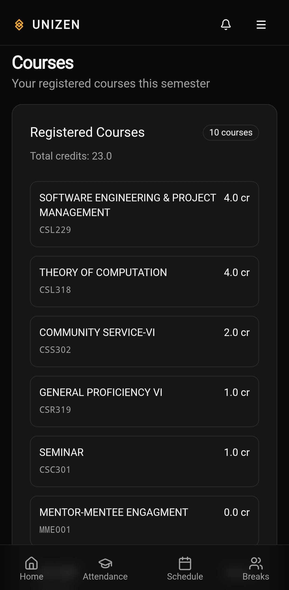
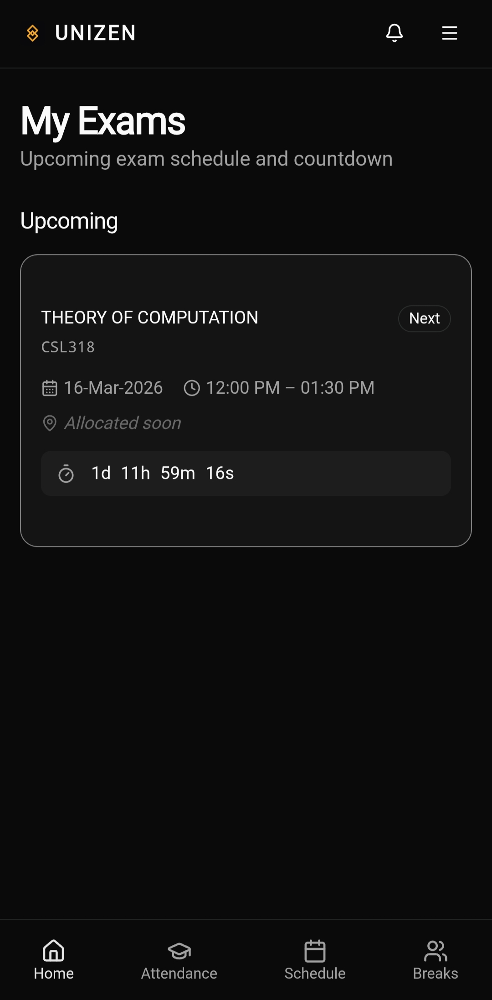
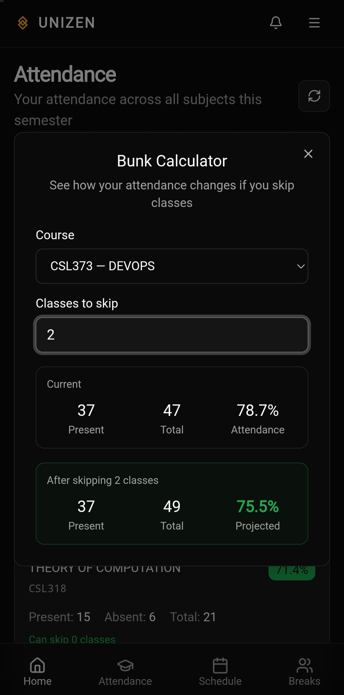
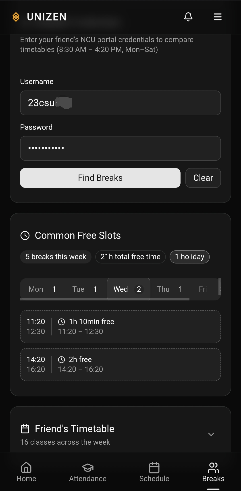

# UNIZEN 🎓
## Student Academic Intelligence Platform

UNIZEN is a product-focused student app that consolidates academic data into a single, high-speed interface.
It eliminates context switching across multiple portals by delivering marks, attendance, timetable, course, and exam insights in one place.

---

## Product Overview

### Problem
Students typically manage academic workflows through fragmented systems, resulting in slow information access and poor planning visibility.

### Solution
UNIZEN unifies core student operations with real-time visibility and planning tools:
- Faster result and attendance access
- Actionable attendance planning
- Exam readiness with countdown and seat/room details
- Collaborative scheduling utilities

---

## Core Capabilities

| Module | Functionality | Outcome |
|---|---|---|
| Internal Marks | Fast retrieval of internal assessment data | Reduced time to results |
| Attendance Summary | Aggregate attendance status | Instant compliance visibility |
| Subject-wise Attendance | Per-subject attendance breakdown | Better subject-level planning |
| Timetable | Schedule view for classes | Daily execution clarity |
| Student Profile | Core student details | Centralized academic identity |
| Courses & Credits | Credit-mapped course list | Academic load awareness |
| Exams | Room no., seat no., and live countdown | Better exam preparedness |

---

## Advanced Product Features

### 1) Bunk Calculator (Attendance Planning Engine)
Computes safe absence capacity based on attendance threshold.

Given:
- `A` = attended classes
- `T` = total classes conducted
- `P` = required attendance threshold (%)

Safe bunks are calculated as:

```text
max_bunks = floor((100 * A / P) - T)
```

This provides students with an immediate, decision-ready attendance buffer.

### 2) Attendance Analytics
Attendance trends are visualized via bar charts to improve pattern recognition and intervention timing.

### 3) Common Break Week Finder
Identifies overlapping free/break windows across friends to simplify coordination and planning.

---

## Technical Design (High-Level)

```text
Institution Data Sources
  ├── Marks
  ├── Attendance
  ├── Timetable
  └── Exams
          ↓
Normalization + Aggregation Layer
          ↓
UNIZEN Application Modules
  ├── Dashboard
  ├── Attendance Intelligence
  ├── Exams Planner
  ├── Course & Credits View
  └── Student Utilities (Bunk + Break Finder)
```

### Engineering Priorities
- **Latency-first retrieval** for academic records
- **Module-oriented feature design** for extensibility
- **Decision-support UX** (not just data display)
- **Visual analytics** for faster interpretation

---

## 📸 Screenshots

| Dashboard | Internal Marks | Attendance Overview |
|---|---|---|
|  |  |  |

| Subject-wise Attendance | Timetable | Courses & Credits |
|---|---|---|
|  |  |  |

| Exam Details | Bunk Calculator | Common Break Week Finder |
|---|---|---|
|  |  |  |


## Repository Scope
The production codebase is private.
This repository is maintained as a public product showcase containing:
- Product architecture summary
- Feature documentation
- UI screenshots
- Short roadmap direction

---

## Roadmap
- Predictive attendance risk scoring
- Smart reminders for exams and attendance thresholds
- Personalized insights across marks, attendance, and schedule behavior

---

## Contact
- **Name:** Vivek Sharma
- **Email:** viveksharma02005@gmail.com
- **LinkedIn:** https://www.linkedin.com/in/vivek-sharma-v021

---

## License
Showcase repository only. All rights reserved unless explicitly stated.
